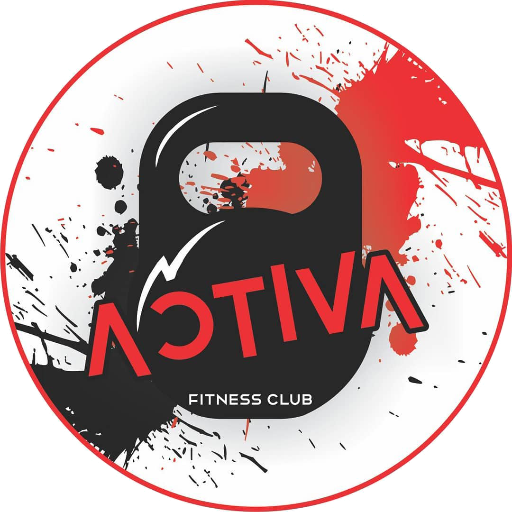

<h1 align="center">
Activa Fitness Club
<h1>

  

<h2 align="center">https://activafitnessclub.herokuapp.com</h2>

<h4 align="center">
    :construction: Proyecto en construcción :construction:
</h4>

   

## :hammer: Información acerca del proyecto
Se trata de una aplicación diseñada a medida para un gimnasio (o centro de entrenamiento personalizado), teniendo en cuenta su necesidad de llevar el control de la información personal de los alumnos, facturación, compras, ventas y rutinas de entrenamiento.

## 🛠️ Tecnologías utilizadas
- React.js
- JavaScript
- Python
- Flask SQLAlchemy

## 🧑‍💻 Desarrollo
Realizado y desarrollado por: <a href="https://www.linkedin.com/in/cecilia-perdomo/" style="text-decoration: none; color: inherit;">Cecilia Perdomo</a>, desde Enero del 2023 y en proceso. 

## 👩‍🎨 Diseñadora UX/UI
Realizado por <a href="https://www.linkedin.com/in/noeliaperdomo/" style="text-decoration: none; color: inherit;">Noelia Perdomo</a>

##
